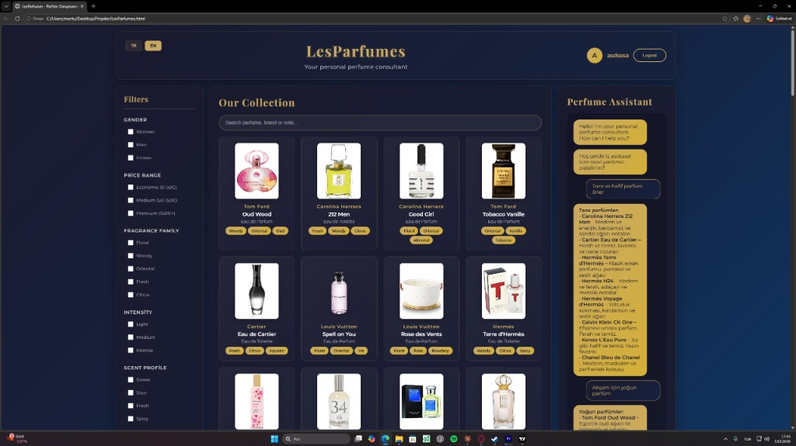

# LesParfumes: E-Commerce Interface & Virtual Consultant

A frontend web application demonstrating advanced client-side state management, dynamic DOM manipulation, and interactive UI design without the use of external frameworks.



## 1. Project Overview
LesParfumes is a custom-built e-commerce interface designed to handle complex, multi-criteria product filtering and real-time user interaction. The primary engineering goal of this project was to construct a robust, state-driven frontend architecture using strictly vanilla web technologies.

## 2. Technical Implementation
* **Filtering Engine:** Implemented a multi-layered filtering algorithm capable of processing simultaneous parameters (Gender, Price, Fragrance Family, Intensity, Scent Profile) and updating the DOM in real-time.
* **State Management:** Handled client-side state for product arrays, active user filters, and UI localization (TR/EN) using pure JavaScript.
* **Interactive UI (Virtual Consultant):** Engineered a custom chat interface utilizing JavaScript event delegation and dynamic DOM injection to simulate consultant interactions.
* **Responsive Architecture:** Utilized modern CSS Grid and Flexbox layouts to ensure a fluid, cross-device user experience while adhering to a strict, dark-mode aesthetic.

## 3. Technology Stack
* **Core:** HTML5, CSS3, Vanilla JavaScript (ES6+)
* **Architecture Design:** Event-driven programming, Dynamic Array Filtering, DOM Manipulation

## 4. Local Setup
To run this project locally, no build tools or backend servers are required.

1. Clone the repository:
   ```bash
   git clone [https://github.com/NiteSole/LesParfumes.git](https://github.com/NiteSole/LesParfumes.git)
